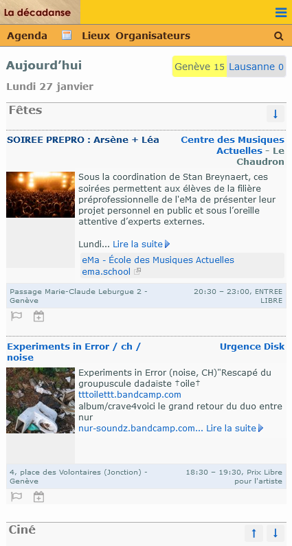

# La décadanse
📅 Agenda culturel local

> [!WARNING]
> En raison d'une grande partie de code legacy, et pour des raisons de sécurité, ne déployez pas cette application sur des serveurs publics. La [modernisation est en cours](https://github.com/users/agilare/projects/2/views/1), vous pouvez [contribuer](README.md#contribuer)

La décadanse est un site web qui présente aux visiteurs une sélection d'événements culturels locaux et accessibles. Il est actuellement [déployé pour Genève et Lausanne](https://www.ladecadanse.ch/)



Les organisateurs d'événements ont la possibilité de s'inscrire puis de se présenter et annoncer leurs événements.

Les principales sections du site sont :
- un **agenda d'événements**, chacun de ceux-ci ayant sa fiche détaillée accompagnée de quelques services (signaler une erreur, format iCal...)
- un répertoire des **Lieux** où se déroulent des événements, avec détails, présentation, photos
- un répertoire des **Organisateurs d'événements**, similaire aux Lieux
- un **back-office** permettant de gérer les diverses entités du site : utilisateurs, événements, lieux, organisateurs, etc.

## Installation locale

Ces instructions vous permettront de mettre en place une copie du projet sur votre machine locale à des fins de développement et de test. Voir [déploiement](README.md#déploiement) pour des notes sur la façon de déployer le projet sur un système actif.

### Installation sans Docker
#### Prérequis
- Apache 2.4
- PHP 8.3 (avec les extensions `fileinfo`, `mysqli`, `mbstring`, `gd`)
- Composer
- MariaDB 10.6/MySQL 5.7 (with `sql_mode` containing `ALLOW_INVALID_DATES`)

#### Étapes
1. cloner la branche `master`
1. `composer install`
1. base de données
    1. créer une base de données avec `COLLATE 'utf8mb4_unicode_ci'` par ex.
        ```mysql
        CREATE DATABASE `ladecadanse` /*!40100 COLLATE 'utf8mb4_unicode_ci' */;
        ```
    1. créer un utilisateur avec les droits suffisants sur cette base de données, par ex.
        ```mysql
        CREATE USER 'ladecadanse'@'localhost' IDENTIFIED BY 'my-password';
        GRANT USAGE ON *.* TO 'ladecadanse'@'localhost';
        GRANT SELECT, INSERT, DELETE, UPDATE  ON `ladecadanse`.* TO 'ladecadanse'@'localhost';
        ```
    1. importer dans la base de données `resources/ladecadanse.sql` (la structure, et les données utiles pour la table `localite`)
    1. ajouter un 1er utilisateur, l'*admin* (groupe 1) qui vous servira à gérer le site (mot de passe : `admin_dev`) :
        ```mysql
        INSERT INTO `personne` (`idPersonne`, `pseudo`, `mot_de_passe`, `cookie`, `groupe`, `statut`, `affiliation`, `region`, `email`,  `signature`, `avec_affiliation`, `gds`, `actif`, `dateAjout`, `date_derniere_modif`) VALUES (NULL, 'admin', '$2y$10$34Z0QxaycAgPFQGtiVzPbeoZFN1kwLEdWDEBI1kEOJGK4A3xRJtMa', '', '1', 'actif', '', 'ge', '', 'pseudo', 'non', '', '1', '0000-00-00 00:00:00.000000', '0000-00-00 00:00:00.000000');
        ```
1. `cp app/env_model.php app/env.php` ainsi que `cp app/db.config_model.php app/db.config.php` et y saisir les valeurs de votre environnement (davantage d'explications et exemples se trouvent dans les fichiers même), avec au minimum les informations de connexion à la base de données
1. `cp .htaccess.example .htaccess` si vous voulez implémenter une configuration PHP et Apache de base pour le développement en local

### Installation avec Docker

Une configuration Docker est fournie pour exécuter le site en environnement local ou en production.

L’utilisation de Make simplifie la gestion des conteneurs. Les principales actions (build, start, stop, logs, etc.) sont accessibles via des cibles prédéfinies dans le Makefile.

#### Développement
```sh
make dev                    # Démarrer l'environnement de développement
make logs-dev               # Voir les logs
make shell-dev              # Ouvrir un shell dans le conteneur
```

#### Production
```sh
make prod                   # Démarrer l'environnement de production
make logs-prod              # Voir les logs
make shell-prod             # Ouvrir un shell dans le conteneur
```

#### Commandes disponibles
```sh
make help                   # Afficher toutes les commandes disponibles
```

Le site ladecadanse est déployé sur localhost:7777 (dev) ou localhost:8080 (prod). Le mot de passe, par défaut, pour l'utilisateur `admin` est `admin_dev`.

### Usage
Une fois le site fonctionnel, se connecter avec le login *admin* (créé ci-dessus) permet d'ajouter et modifier des événements, lieux, etc. (partie publique) et de les gérer largement (partie back-office)

## Tests

See [tests/README.md](tests/README.md)

## Déploiement

### Prérequis
Un espace sur un serveur avec l'infrastructure prérequise, une timezone définie et une base de données

### Avec Git-ftp

#### Prérequis
1. installer [git-ftp](https://github.com/git-ftp/git-ftp/blob/master/INSTALL.md)
1. dans le répertoire du projet, configurer les données de connexion (ici avec un scope pour le site de production : `prod`) :
    ```sh
    $ git config git-ftp.prod.user mon-login
    $ git config git-ftp.prod.url "ftp://le-serveur.ch/web"
    $ git config git-ftp.prod.password 'le-mot-de-passe'
    ```

#### Pour mettre en place
1. premier envoi des fichiers
    ```sh
    $ git ftp init -s prod
    ```
1. dans `app/env.php` [configurer le site  selon l'environnement](README.md#manuelle)

#### Pour mettre à jour avec les derniers commits
```sh
$ git ftp push -s prod
```

## Analyse du code

Cinq analyseurs de code PHP sont disponibles et peuvent être exécutés via Composer.

- ils sont configurés pour la version de PHP [requise](#Prerequis)
- le niveau d'analyse est réglé aussi haut que possible, mais pas trop pour ne pas relever les erreurs dûes à l'ancienneté du code (par ailleurs certaines erreurs peu ou pas pertinentes sont ignorées) et ciblé plutôt pour la version de PHP requise
- les répertoires vendor, var, etc. sont ignorés

### phpstan

```sh
$ composer phpstan
```

Erreurs nombreuses et peu importantes ignorées stockées dans `phpstan-baseline.neon`

### Rector

Sans modification directe du code :
```sh
$ composer rector:dry-run
```

### Psalm

```sh
$ composer psalm
```

### Phan

```sh
./vendor/bin/phan --progress-bar -o phan.txt
```

puis éventuellement, pour abréger le rapport :

```sh
cat phan80.txt | cut -d ' ' -f2 | sort | uniq -c | sort -n -r
```

### PHPCompatibility

Dispo de PHP 8.0 à 8.4

```sh
$ composer sniffer:php84
```

## Changelog
Voir le [changelog](CHANGELOG.md) et les [releases sur GitHub](https://github.com/agilare/ladecadanse/releases)

## Contribuer

Le projet accepte volontiers de l'aide ; il y a diverses manières de contribuer comme améliorer la sécurité et la qualité du site, tester des fonctionnalités, etc.
Les [lignes directrices pour les contributions](CONTRIBUTING.md) décrivent en détail l'état actuel du projet, les possibilités d'aide et comment le faire.

## Contact
Michel Gaudry - michel@ladecadanse.ch

[GitHub La décadanse](https://github.com/agilare/ladecadanse)

## Licence
This work is licensed under AGPL-3.0-or-later
