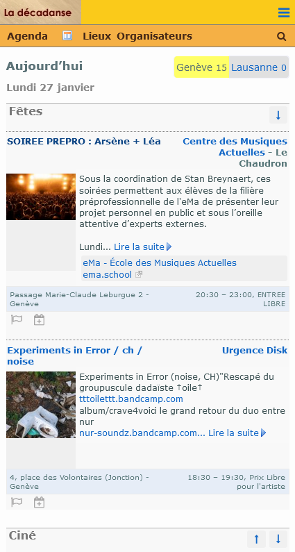

# La décadanse
📅 Agenda culturel local

> [!WARNING]
> En raison d'une grande partie de code legacy, et pour des raisons de sécurité, ne déployez pas cette application sur des serveurs publics. La [modernisation est en cours](https://github.com/users/agilare/projects/4/views/1), vous pouvez [contribuer](README.md#contribuer)

La décadanse est un site web qui présente aux visiteurs une sélection d'événements culturels locaux et accessibles. Il est actuellement [déployé pour Genève et les environs](https://www.ladecadanse.ch/)



Les organisateurs d'événements ont la possibilité de s'inscrire puis annoncer leurs événements et enfin se présenter.

Les principales sections du site sont :
- un **agenda d'événements**, chacun de ceux-ci ayant sa fiche détaillée accompagnée de quelques petits services (signaler une erreur, partager...)
- un répertoire des **Lieux** où se déroulent des événements, avec détails, présentation, photos
- un répertoire des **Organisateurs d'événements**, similaire aux Lieux
- un **back-office** permettant de gérer les diverses entités du site : utilisateurs, événements, lieux, organisateurs, etc.

## Installation locale

Ces instructions vous permettront de mettre en place une copie du projet sur votre machine locale à des fins de développement et de test. Voir [déploiement](README.md#déploiement) pour des notes sur la façon de déployer le projet sur un système actif.

### Installation sans Docker

#### Prérequis
- Apache 2.4
- PHP 8.4 (avec les extensions `fileinfo`, `mysqli`, `mbstring`, `gd`)
- [Composer](https://getcomposer.org/)
- MariaDB 10.11 (si possible avec `innodb_ft_min_token_size=3` et `ft_min_word_len=3`, pour de meilleurs résultats dans la recherche d'événements)

#### Étapes
1. cloner la branche `master`
1. `composer install`
1. base de données
    1. créer une base de données avec `COLLATE 'utf8mb4_unicode_ci'` par ex.
        ```mysql
        CREATE DATABASE `ladecadanse` /*!40100 COLLATE 'utf8mb4_unicode_ci' */;
        ```
    1. créer un utilisateur avec les droits suffisants sur cette base de données, par ex.
        ```mysql
        CREATE USER 'ladecadanse'@'localhost' IDENTIFIED BY 'my-password';
        GRANT USAGE ON *.* TO 'ladecadanse'@'localhost';
        GRANT SELECT, INSERT, DELETE, UPDATE  ON `ladecadanse`.* TO 'ladecadanse'@'localhost';
        ```
    1. dans la base de données, exécuter les fichiers sous `resources/database/` :
        1. création de la structure et les données utiles pour la table `localite` avec `ladecadanse.sql`
        1. mises à jour avec `v3-6-3_localite-add-regions_covered.sql`, etc.
    1. ajouter un 1er utilisateur, l'*admin* (groupe 1) qui vous servira à gérer le site (mot de passe : `admin_dev`) :
        ```mysql
        INSERT INTO `personne` (`idPersonne`, `pseudo`, `mot_de_passe`, `cookie`, `groupe`, `statut`, `affiliation`, `region`, `email`,  `signature`, `avec_affiliation`, `gds`, `actif`, `dateAjout`, `date_derniere_modif`) VALUES (NULL, 'admin', '$2y$10$34Z0QxaycAgPFQGtiVzPbeoZFN1kwLEdWDEBI1kEOJGK4A3xRJtMa', '', '1', 'actif', '', 'ge', 'test@ladecadanse.ch', 'pseudo', 'non', '', '1', '0000-00-00 00:00:00.000000', '0000-00-00 00:00:00.000000');
        ```
1. créer vos fichiers de configuration en faisant `cp app/env_model.php app/env.php` ainsi que `cp app/db.config_model.php app/db.config.php` et y saisir les valeurs de votre environnement (davantage d'explications et exemples se trouvent dans les fichiers même), avec au minimum les informations de connexion à la base de données
1. `composer htaccess` compose le `.htaccess` (configuration Apache et PHP pour le développement local) à partir des fragments de `htaccess/` — voir [docs/htaccess.md](docs/htaccess.md). Sans passer par Composer : `php bin/htaccess.php`

### Installation avec Docker

Une configuration Docker est fournie pour exécuter le site en environnement local ou en production.

L'utilisation de Make simplifie la gestion des conteneurs. Les principales actions (build, start, stop, logs, etc.) sont accessibles via des cibles prédéfinies dans le Makefile.

#### Configuration des environnements

Le projet utilise un fichier unique `docker/env/env.php` pour tous les environnements. Les paramètres spécifiques à l'environnement (développement ou production) sont définis via des variables d'environnement Docker :

- **Développement** : `APP_ENV=dev` et `APP_DEBUG=true`
- **Production** : `APP_ENV=prod` et `APP_DEBUG=false`

Ces variables sont automatiquement configurées dans `docker-compose.yml` selon le profil Docker utilisé.

**Important** : Avant de déployer en production, assurez-vous de configurer les valeurs sensibles dans `docker/env/env.php` (clés API, identifiants SMTP, etc.).

#### Permissions sur les répertoires inscriptibles (hôtes Linux)

Le code source est monté dans le conteneur depuis l'hôte. Sur un hôte Linux, les fichiers appartiennent à votre utilisateur alors qu'Apache écrit en `www-data` : sans alignement, l'application ne peut écrire ni les logs (`var/logs`) ni les images téléversées (`web/uploads`).

Créez un fichier `.env` à la racine du projet, lu automatiquement par Docker Compose :

```sh
printf 'UID=%s\nGID=%s\n' "$(id -u)" "$(id -g)" > .env
```

Puis reconstruisez l'image : `make build`.

Sous Docker Desktop (Windows et macOS) cette étape est inutile : les montages sont déjà permissifs et les valeurs par défaut conviennent.

Dans tous les cas, l'entrypoint du conteneur (`docker/php/docker-entrypoint.sh`) crée au démarrage les répertoires inscriptibles manquants et corrige leurs permissions si nécessaire.

#### Utilisation

Toutes les commandes acceptent le paramètre `PROFILE=dev` ou `PROFILE=prod` (par défaut : `dev`).

**Développement** (utilise le profil par défaut) :
```sh
make start                  # Démarrer l'environnement de développement
make logs                   # Voir les logs
make shell                  # Ouvrir un shell dans le conteneur
make stop                   # Arrêter les services
```

**Production** (spécifier `PROFILE=prod`) :
```sh
make start PROFILE=prod     # Démarrer l'environnement de production
make logs PROFILE=prod      # Voir les logs
make shell PROFILE=prod     # Ouvrir un shell dans le conteneur
make stop PROFILE=prod      # Arrêter les services
```

**Raccourcis pratiques** :
```sh
make dev                    # Équivalent à : make start
make prod                   # Équivalent à : make start PROFILE=prod
```

#### Commandes disponibles

```sh
make help                   # Afficher toutes les commandes disponibles
make build [PROFILE=...]    # Construire les images Docker
make start [PROFILE=...]    # Démarrer les services
make stop [PROFILE=...]     # Arrêter les services
make restart [PROFILE=...]  # Redémarrer les services
make logs [PROFILE=...]     # Afficher les logs (mode suivi)
make shell [PROFILE=...]    # Ouvrir un shell dans le conteneur web
make status [PROFILE=...]   # Afficher le statut des services
make clean [PROFILE=...]    # Nettoyer l'environnement (conteneurs, images, volumes)
make install-deps [PROFILE=...]     # Installer les dépendances PHP
make composer-update [PROFILE=...]  # Mettre à jour les dépendances Composer
make composer-require PACKAGE=...   # Ajouter un package Composer
```

Le site ladecadanse est déployé sur localhost:7777 (dev) ou localhost:8080 (prod). Le mot de passe, par défaut, pour l'utilisateur `admin` est `admin_dev`.

### Usage
Une fois le site fonctionnel, se connecter avec le login *admin* (créé ci-dessus) permet d'ajouter et modifier des événements, lieux, etc. (partie publique) et de les gérer (partie back-office)

### Raccourcis clavier

Sur tout le site : `h` accueil, `s` recherche, `a` ajouter un événement, `l` lieux, `o` organisateurs, `d` dashboard admin. Pour les admins, `b` gérer les événements et `u` utilisateurs : ces deux touches visent les liens du menu d'en-tête, que `_header.inc.php` ne rend que pour eux, si bien que pour tout autre visiteur la touche garde son comportement natif. Sur une fiche : `e` éditer, et sur un événement `f` flyer, `c` copier. Sur l'agenda : flèches gauche/droite pour changer de jour. `/` place le curseur dans le champ de filtre des listes qui en ont un : lieux, organisateurs, gérer les événements, utilisateurs.

Les flèches gauche/droite servent aussi de pagination sur les listes qui portent un bloc de pagination — recherche, lieux, organisateurs, profil utilisateur, gérer les événements, utilisateurs. À la première ou à la dernière page le lien est un `<span class="disabled">`, et la flèche retrouve son rôle de défilement.

Dans les listes d'entités — agenda, résultats de recherche, événements d'un lieu ou d'un organisateur, les trois tables du dashboard admin à la suite, lieux, organisateurs, gérer les événements, utilisateurs — `j` passe à l'entité suivante et `k` à la précédente, à la manière de vi, plutôt que de tabuler à travers chaque lien secondaire d'une ligne. Le focus va sur le lien principal de la ligne : Entrée ouvre la fiche, les lecteurs d'écran l'annoncent et Tab reprend de là ; la ligne courante est mise en évidence via `:focus-within`. Le parcours s'arrête aux extrémités et ne change pas de page. Sur une fiche d'événement, où il n'y a pas de liste à parcourir, `j` et `k` suivent les liens vers l'événement suivant et précédent du même jour, de sorte que le parcours commencé sur l'agenda se poursuit à l'intérieur de l'événement. Les flèches gauche/droite, elles, gardent partout un seul sens : changer de jour ou de page, jamais d'élément.

Chaque liste est décrite pour sa page dans le registre `LISTS`, à côté de celui des raccourcis. Les raccourcis sont résolus sur `event.key`, jamais `event.code`, pour rester utilisables quel que soit le layout clavier du visiteur (AZERTY, QWERTZ, QWERTY...). Le registre est unique, dans `web/js/shortcuts.js`, et partagé par les deux fonctionnalités pour qu'elles ne puissent pas diverger.

**Mode mouseless** (ADMIN et SUPERADMIN) : `?mouseless=1` sur n'importe quelle page neutralise le clic de souris sur les éléments couverts par un raccourci et affiche la touche de chacun dans un badge `<kbd>` — dans le placeholder pour les champs texte — de quoi les faire entrer dans les doigts. Un clic bloqué fait clignoter le badge. La navigation au clavier n'est pas touchée : Tab + Entrée suit toujours un lien. Le mode suit la navigation (`localStorage`) et se quitte par une double frappe d'Échap — la touche sert à trop de choses par ailleurs (fermer la fenêtre du flyer, annuler une saisie) pour qu'un appui isolé suffise, et le premier appui fait clignoter le rappel du bandeau —, par le lien du bandeau ou par `?mouseless=0`. Dans les listes, les liens de ligne restent cliquables et sans badge — en badger cinquante noierait la page —, le bandeau annonçant `j` et `k` à la place. Le mode est ignoré sur les pointeurs grossiers, où il n'y a pas de clavier physique.

## Tests

See [tests/README.md](tests/README.md)

## Déploiement

### Prérequis
Un espace sur un serveur avec l'infrastructure prérequise, une timezone définie et une base de données

### Avec Git-ftp

#### Prérequis
1. installer [git-ftp](https://github.com/git-ftp/git-ftp/blob/master/INSTALL.md)
1. dans le répertoire du projet, configurer les données de connexion (ici avec un scope pour le site de production : `prod`) :
    ```sh
    $ git config git-ftp.prod.user mon-login
    $ git config git-ftp.prod.url "ftp://le-serveur.ch/web"
    $ git config git-ftp.prod.password 'le-mot-de-passe'
    ```

> [!NOTE]
> Pour voir sa config git ftp : `git config -l | grep git-ftp`

#### Pour mettre en place
1. premier envoi des fichiers
    ```sh
    $ git ftp init -s prod
    ```
1. dans `app/env.php` [configurer le site  selon l'environnement](README.md#manuelle)

#### Pour mettre à jour avec les derniers commits

```sh
$ composer deploy
```

`composer deploy` compose le `.htaccess` à partir de ses fragments, puis lance `git ftp push`.

L'enchaînement n'est pas cosmétique. Le `.htaccess` est ignoré par git — pour que les
règles propres à l'exploitation (adresses bannies, robots) ne deviennent pas publiques —
mais git-ftp l'envoie quand même, grâce à `!.htaccess` dans `.git-ftp-include`. Ce
mécanisme envoie **le fichier présent sur le disque** : sans recomposition préalable, un
essai local oublié partirait en production. Voir [docs/htaccess.md](docs/htaccess.md).

Les fragments d'exploitation vivent dans le dépôt privé `ladecadanse-docs`. `composer deploy`
refuse de partir s'il ne les trouve pas, plutôt que de déployer une production sans ses
blocages. Le scope git-ftp et leur emplacement se surchargent au besoin :

```sh
$ php bin/htaccess.php --deploy --scope=ik --ops-dir=/chemin/vers/ladecadanse-docs/htaccess
```

Pour ne pousser que le code, sans toucher au `.htaccess` :

```sh
$ git ftp push -s prod
```

#### Après le déploiement

Une requête suffit à vérifier que le `.htaccess` est arrivé et qu'il est valide :

```sh
$ curl -I https://www.ladecadanse.ch/lausanne
```

Une 301 vers `/index.php?region=vd` : le compte est bon. Une 500 signale une directive
refusée par le serveur ; une 404, que le fichier n'est pas arrivé.

## Analyse du code

Cinq analyseurs de code PHP sont disponibles et peuvent être exécutés via Composer.

- ils sont configurés pour la version de PHP [requise](#Prerequis)
- le niveau d'analyse est réglé aussi haut que possible, mais pas trop pour ne pas relever les erreurs dûes à l'ancienneté du code (par ailleurs certaines erreurs peu ou pas pertinentes sont ignorées) et ciblé plutôt pour la version de PHP requise
- les répertoires vendor, var, etc. sont ignorés

### phpstan

```sh
$ composer phpstan
```

Erreurs nombreuses et peu importantes ignorées stockées dans `phpstan-baseline.neon`

### Rector

Exécuter sans modifier directement les fichiers (aperçu) :
```sh
$ composer rector:dry-run
```

### Rector Jack

Aide à repérer et mettre à jour les dépendances Composer obsolètes (`rector/jack`, séparé de Rector) :
```sh
$ ./vendor/bin/jack list
```

Commandes utiles : `breakpoint` (échoue si trop de paquets majeurs sont en retard, utile en CI), `open-versions` (assouplit les contraintes de version vers la version suivante), `raise-to-installed` (aligne `composer.json` sur les versions installées).

### Psalm

```sh
$ composer psalm
```

Doit rester vert : les problèmes connus sont dans `psalm-baseline.xml`, à régénérer avec
`./vendor/bin/psalm --set-baseline=psalm-baseline.xml` après une montée de version.

Les globales du legacy (`$connector`, `$glo_*`, `$rep_*`…) sont déclarées dans la section
`<globals>` de `psalm.xml` ; l'ajouter d'une nouvelle globale dans `app/config.php` ou
`app/bootstrap.php` implique de l'y déclarer aussi.

Analyse de teinte (recherche de données utilisateur atteignant un point sensible : SQL,
`include`, en-têtes, requêtes réseau…). Complémentaire de PHPStan, qui ne fait pas ce type
d'analyse :
```sh
$ composer psalm:taint
```

Attention au bruit : l'essentiel des résultats est du `TaintedHtml`/`TaintedTextWithQuotes`
sur le vieux code d'affichage. Les catégories à regarder en priorité sont `TaintedSql`,
`TaintedFile`, `TaintedSSRF`, `TaintedHeader` et `TaintedCookie`.

L'unique `TaintedSql` restant (rapporté sur `DbConnector::query()`, tracé jusqu'à
`user-edit.php`) est un faux positif documenté dans le code : Psalm teinte les *clés* de
`$champs` alors que seules les valeurs viennent de `$_POST`. Il n'est pas supprimable via
`@psalm-suppress` puisque l'erreur est ancrée sur le sink et non sur le site d'appel.

### Phan

```sh
./vendor/bin/phan --progress-bar -o phan.txt
```

puis éventuellement, pour abréger le rapport :

```sh
cat phan80.txt | cut -d ' ' -f2 | sort | uniq -c | sort -n -r
```

### PHPCompatibility

Dispo de PHP 8.0 à 8.4

Pour 8.4 :

```sh
$ composer sniffer:php84
```

> [!NOTE]
> `squizlabs/php_codesniffer` reste volontairement sur la branche `^3.13` : la version 4.0 n'est pour l'instant supportée que par une version alpha de `phpcompatibility/php-compatibility` (`10.0.0-alpha2`). À réévaluer quand une version stable sortira.

## Changelog
Voir le [changelog](CHANGELOG.md) et les [releases sur GitHub](https://github.com/agilare/ladecadanse/releases)

Pour passer à une nouvelle version (migrations de base de données, nouvelles clés de configuration, effets de bord), voir [UPGRADE.md](UPGRADE.md).

## Documentation

Le fonctionnement des parties du site qui demandent plus qu'une ligne de changelog est documenté dans [docs/](docs/) : [événements](docs/evenements.md), [flux RSS](docs/rss.md), [suivi des bots](docs/bots.md).

## Contribuer

Le projet accepte volontiers de l'aide ; il y a diverses manières de contribuer comme améliorer la sécurité et la qualité du site, tester des fonctionnalités, etc.
Les [lignes directrices pour les contributions](CONTRIBUTING.md) décrivent en détail l'état actuel du projet, les possibilités d'aide et comment le faire.

## Contact
Michel Gaudry - michel@ladecadanse.ch

[GitHub La décadanse](https://github.com/agilare/ladecadanse)

## Licence
This work is licensed under AGPL-3.0-or-later

The rejected password list `resources/bad_p.txt` comes from
[tarraschk/richelieu](https://github.com/tarraschk/richelieu) (most common French passwords),
licensed under CC BY 4.0.
