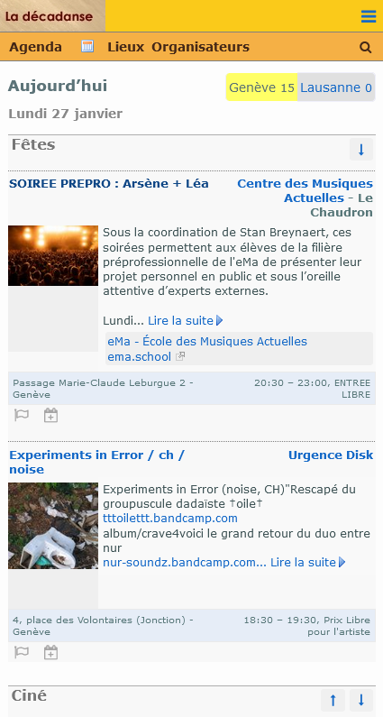

# La décadanse
📅 Agenda culturel local

> [!WARNING]
> En raison d'une grande partie de code legacy, et pour des raisons de sécurité, ne déployez pas cette application sur des serveurs publics. La [modernisation est en cours](https://github.com/users/agilare/projects/4/views/1), vous pouvez [contribuer](README.md#contribuer)

La décadanse est un site web qui présente aux visiteurs une sélection d'événements culturels locaux et accessibles. Il est actuellement [déployé pour Genève et les environs](https://www.ladecadanse.ch/)



Les organisateurs d'événements ont la possibilité de s'inscrire puis annoncer leurs événements et enfin se présenter.

Les principales sections du site sont :
- un **agenda d'événements**, chacun de ceux-ci ayant sa fiche détaillée accompagnée de quelques petits services (signaler une erreur, partager...)
- un répertoire des **Lieux** où se déroulent des événements, avec détails, présentation, photos
- un répertoire des **Organisateurs d'événements**, similaire aux Lieux
- un **back-office** permettant de gérer les diverses entités du site : utilisateurs, événements, lieux, organisateurs, etc.

## Installation locale

Ces instructions vous permettront de mettre en place une copie du projet sur votre machine locale à des fins de développement et de test. Voir [déploiement](README.md#déploiement) pour des notes sur la façon de déployer le projet sur un système actif.

### Installation sans Docker

#### Prérequis
- Apache 2.4
- PHP 8.4, avec les extensions exigées par `composer.json` et ses dépendances : `composer check-platform-reqs` les liste et signale celles qui manquent (`--no-dev` pour s'en tenir à ce que le site demande en production). `composer install` refuse de toute façon de s'exécuter tant qu'il en manque une
- [Composer](https://getcomposer.org/)
- [Node.js](https://nodejs.org/) 20.19+, 22.13+ ou 24+, avec npm — pour les [bibliothèques front-end](#bibliothèques-front-end), le lint et les tests JavaScript
- MariaDB 10.11 (si possible avec `innodb_ft_min_token_size=3` et `ft_min_word_len=3`, pour de meilleurs résultats dans la recherche d'événements)

Facultatif : `imagick` et Ghostscript, pour convertir en image les PDF **collés en URL** dans le formulaire d'événement. Sans eux le site fonctionne normalement, et les PDF **envoyés en fichier** sont convertis de toute façon — c'est le navigateur qui s'en charge. L'ensemble est désactivé par défaut : voir [Accepter les PDF dans les champs image](#accepter-les-pdf-dans-les-champs-image).

#### Étapes
1. cloner la branche `master`
1. `composer install`
1. `npm ci`, qui installe les bibliothèques front-end et les copie dans `web/libs/` — voir [Bibliothèques front-end](#bibliothèques-front-end)
1. base de données
    1. créer une base de données avec `COLLATE 'utf8mb4_unicode_ci'` par ex.
        ```mysql
        CREATE DATABASE `ladecadanse` /*!40100 COLLATE 'utf8mb4_unicode_ci' */;
        ```
    1. créer un utilisateur avec les droits suffisants sur cette base de données, par ex.
        ```mysql
        CREATE USER 'ladecadanse'@'localhost' IDENTIFIED BY 'my-password';
        GRANT USAGE ON *.* TO 'ladecadanse'@'localhost';
        GRANT SELECT, INSERT, DELETE, UPDATE  ON `ladecadanse`.* TO 'ladecadanse'@'localhost';
        ```
    1. dans la base de données, exécuter `resources/database/ladecadanse.sql`, qui crée la structure et remplit la table `localite`. Ce dump est figé à la 3.13.0 : les changements de schéma postérieurs s'appliquent à l'étape `composer db:migrate` ci-dessous
    1. ajouter un 1er utilisateur, l'*admin* (groupe 1) qui vous servira à gérer le site (mot de passe : `admin_dev`) :
        ```mysql
        INSERT INTO `personne` (`idPersonne`, `pseudo`, `mot_de_passe`, `cookie`, `groupe`, `statut`, `affiliation`, `region`, `email`,  `signature`, `avec_affiliation`, `gds`, `actif`, `dateAjout`, `date_derniere_modif`) VALUES (NULL, 'admin', '$2y$10$34Z0QxaycAgPFQGtiVzPbeoZFN1kwLEdWDEBI1kEOJGK4A3xRJtMa', '', '1', 'actif', '', 'ge', 'test@ladecadanse.ch', 'pseudo', 'non', '', '1', '0000-00-00 00:00:00.000000', '0000-00-00 00:00:00.000000');
        ```
1. créer vos fichiers de configuration en faisant `cp app/env_model.php app/env.php` ainsi que `cp app/db.config_model.php app/db.config.php` et y saisir les valeurs de votre environnement (davantage d'explications et exemples se trouvent dans les fichiers même), avec au minimum les informations de connexion à la base de données
1. `composer db:migrate` applique à la base les migrations que le dump ne porte pas encore, et enregistre les autres — voir [resources/database/README.md](resources/database/README.md). Il se connecte avec l'entrée `default` de `app/db.config.php` ; si son compte n'a pas les droits `ALTER`, `CREATE`, `INDEX` et `DROP`, lui en substituer un autre par `migration_user` et `migration_password`
1. `composer config:build` compose le `.htaccess` et le `.user.ini` (configuration Apache et PHP) à partir des fragments de `htaccess/` et `userini/` — voir [docs/config-serveur.md](docs/config-serveur.md). Sans passer par Composer : `php bin/build-config.php`

### Installation avec Docker

Une configuration Docker est fournie pour exécuter le site en environnement local ou en production.

Seul Docker est requis sur l'hôte, avec Compose v2 (`docker compose`) : ni PHP, ni Composer, ni Node. À chaque démarrage, deux conteneurs à usage unique préparent le code monté avant qu'Apache ne démarre :

- `composer-dev` (ou `composer-prod`) installe `vendor/` ;
- `npm` lance `npm ci`, qui installe les [bibliothèques front-end](#bibliothèques-front-end) et les copie dans `web/libs/`. Son `node_modules/` vit dans un volume Docker, pas dans celui de l'hôte, qui reste libre pour `npm run lint` et `npm test`.

Les voir `Exited` après le démarrage est le fonctionnement normal, pas un échec.

#### Configuration des environnements

Le projet utilise un fichier unique `docker/env/env.php` pour tous les environnements. Les paramètres spécifiques à l'environnement (développement ou production) sont définis via des variables d'environnement Docker :

- **Développement** : `APP_ENV=dev` et `APP_DEBUG=true`
- **Production** : `APP_ENV=prod` et `APP_DEBUG=false`

Ces variables sont automatiquement configurées dans `docker-compose.yml` selon le profil Docker utilisé.

**Important** : Avant de déployer en production, assurez-vous de configurer les valeurs sensibles dans `docker/env/env.php` (clés API, identifiants SMTP, etc.).

#### Permissions sur les répertoires inscriptibles (hôtes Linux)

Le code source est monté dans le conteneur depuis l'hôte. Sur un hôte Linux, les fichiers appartiennent à votre utilisateur alors qu'Apache écrit en `www-data` : sans alignement, l'application ne peut écrire ni les logs (`var/logs`) ni les images téléversées (`web/uploads`).

Créez un fichier `.env` à la racine du projet, lu automatiquement par Docker Compose :

```sh
printf 'UID=%s\nGID=%s\n' "$(id -u)" "$(id -g)" > .env
```

Puis reconstruisez l'image : `docker compose --profile dev build --no-cache`.

Sous Docker Desktop (Windows et macOS) cette étape est inutile : les montages sont déjà permissifs et les valeurs par défaut conviennent.

Dans tous les cas, l'entrypoint du conteneur (`docker/php/docker-entrypoint.sh`) crée au démarrage les répertoires inscriptibles manquants et corrige leurs permissions si nécessaire.

#### Utilisation

Les commandes passent par `docker compose` avec un profil, `dev` ou `prod`, depuis la racine du projet :

```sh
docker compose --profile dev up -d --build     # Construire si besoin et démarrer (localhost:7777)
docker compose --profile dev ps -a             # Statut des services, conteneurs à usage unique compris
docker compose --profile dev logs -f web-dev   # Logs d'Apache et de PHP
docker compose --profile dev exec web-dev bash # Shell dans le conteneur web
docker compose --profile dev down              # Arrêter
```

Pour la production, remplacer `dev` par `prod` et `web-dev` par `web-prod` (localhost:8080).

Réinstaller les dépendances sans redémarrer, après un `git pull` qui touche `composer.lock` ou `package-lock.json` :

```sh
docker compose --profile dev run --rm composer-dev   # vendor/
docker compose --profile dev run --rm npm            # web/libs/
```

#### Avec Make

Le `Makefile` enveloppe ces mêmes commandes, pour qui a `make` (Linux, macOS, WSL ; il n'est pas fourni sous Windows). Toutes les cibles acceptent `PROFILE=dev` ou `PROFILE=prod`, `dev` par défaut :

```sh
make help                   # Afficher toutes les commandes disponibles
make build [PROFILE=...]    # Construire les images Docker, sans cache
make start [PROFILE=...]    # Démarrer les services
make stop [PROFILE=...]     # Arrêter les services
make restart [PROFILE=...]  # Redémarrer les services
make logs [PROFILE=...]     # Afficher les logs (mode suivi)
make shell [PROFILE=...]    # Ouvrir un shell dans le conteneur web
make status [PROFILE=...]   # Afficher le statut des services
make clean [PROFILE=...]    # Nettoyer l'environnement (conteneurs, images, volumes)
make install-deps [PROFILE=...]     # Installer les dépendances PHP et les bibliothèques front-end
make composer-update [PROFILE=...]  # Mettre à jour les dépendances Composer
make composer-require PACKAGE=...   # Ajouter un package Composer
```

#### Composer et configuration Apache

Composer est installé dans le conteneur web de développement : `docker compose --profile dev exec web-dev bash`, puis `composer phpstan`, `composer test:api`, `composer config:build`, etc. Ces scripts tournent ainsi sur le PHP 8.4 de l'application et ses extensions.

Le service `composer-dev`, lui, a son propre PHP, sans les extensions de l'application, d'où son `--ignore-platform-reqs`.

Sans `.htaccess`, le site répond déjà, mais sans ses redirections ni ses règles de sécurité. `composer config:build`, lancé dans le conteneur, le compose comme en production — voir [docs/config-serveur.md](docs/config-serveur.md) ; l'image active pour cela `mod_rewrite` et `mod_headers`.

#### Base de données

La base est initialisée depuis `resources/database/ladecadanse.sql`, puis par les fixtures de `docker/env/` : le compte `admin` et un lieu de test. Ces scripts ne tournent qu'à la **création du volume**.

Les migrations se passent ensuite depuis l'hôte, que la base soit neuve ou déjà créée : le conteneur `composer-dev` n'a pas les extensions de l'application, et le service `db` expose MariaDB sur le port 9906. Ajouter à `app/db.config.php` une entrée qui le vise, par exemple `'docker' => ['host' => '127.0.0.1;port=9906', 'dbname' => 'ladecadanse', 'user' => 'root', 'password' => 'dev']`, puis :

```sh
LADECADANSE_DB=docker composer db:migrate
```

Voir [resources/database/README.md](resources/database/README.md).

Pour repartir d'une base neuve : `docker compose --profile dev down -v`, qui supprime les volumes, puis `docker compose --profile dev up -d`.

Le site ladecadanse est déployé sur localhost:7777 (dev) ou localhost:8080 (prod). Le mot de passe, par défaut, pour l'utilisateur `admin` est `admin_dev`.

### Bibliothèques front-end

Les bibliothèques servies au navigateur depuis le site même — jQuery, Leaflet, Font Awesome, Magnific Popup, select2, Zebra_Datepicker, checkboxes.js, normalize.css, pdf.js — sont déclarées dans les `dependencies` de `package.json`, à version exacte. Elles ne sont pas versionnées : `npm ci` les télécharge dans `node_modules/`, puis son hook `postinstall` lance `bin/libs-sync.mjs`, qui copie dans `web/libs/` les seuls fichiers que les pages chargent. Aucune étape de build : ce sont les fichiers publiés par chaque projet, tels quels.

TinyMCE et le SDK Sentry restent chargés depuis leur CDN : tous deux sont liés à un service (clé d'API, DSN), pas à un fichier qu'on pourrait figer. Les tuiles de la carte viennent d'OpenStreetMap pour la même raison.

`npm ci` avertit `EBADENGINE` sous Node 22 : select2 4.1.0 déclare exiger Node 24 pour ses propres outils de build, dont rien ne sert ici puisque seuls ses fichiers publiés sont copiés. L'avertissement est sans conséquence.

Mettre à jour une bibliothèque :

```sh
npm outdated                                # ce qui a du retard
npm install --save-exact select2@4.1.1      # met à jour package.json, package-lock.json et web/libs/
```

Si la nouvelle version déplace ou renomme un fichier, `npm install` échoue en nommant la source introuvable : corriger la liste de `bin/libs-sync.mjs`, puis `npm run libs:sync`. Même chose pour ajouter une bibliothèque — une entrée dans `dependencies`, une ligne par fichier dans le script, et la balise dans `_header.inc.php` ou `_footer.inc.php`.

`web/libs/` part en production avec le code, sans Node sur le serveur — voir [Déploiement](#pour-mettre-à-jour-avec-les-derniers-commits).

### Peupler la base depuis la production

Une base neuve est vide, et saisir à la main de quoi éprouver l'agenda est vite décourageant. `composer prod-copy` fabrique une copie locale **anonymisée** de la production, réduite aux derniers événements ajoutés et à tout ce qu'ils référencent, et rapatrie les flyers et photos correspondants dans `web/uploads/`.

```sh
composer prod-copy -- --limit=1000
```

Le prérequis est un **accès SSH** au serveur, qui sert deux fois : l'offre Infomaniak n'ouvrant pas MySQL à l'extérieur, la base se lit à travers un tunnel, et les quelque 2700 fichiers descendent par la même voie en une minute. La mise en place, la procédure d'essai, les vérifications et ce que l'anonymisation remplace exactement sont dans [docs/prod-copy.md](docs/prod-copy.md).

### Accepter les PDF dans les champs image

Désactivé par défaut. Le drapeau `PDF_CONVERSION_ENABLED` d'`app/env.php` prend trois valeurs :

```php
define("PDF_CONVERSION_ENABLED", false);       // personne
define("PDF_CONVERSION_ENABLED", 'preview');   // administrateurs seulement
define("PDF_CONVERSION_ENABLED", true);        // tout le monde
```

Tant que le drapeau est absent ou faux, les champs flyer et image n'annoncent pas le PDF, ne l'acceptent pas, et pdf.js n'est jamais chargé : le formulaire est exactement celui d'avant.

`'preview'` sert à éprouver une fonctionnalité conséquente sur le site en ligne sans l'exposer au public. Le texte d'aide signale alors qu'on est seul à la voir — sans quoi une préversion s'oublie et l'on croit la fonctionnalité livrée. Le mécanisme est générique (`Ladecadanse\FeatureFlag`) et se réutilise pour tout autre drapeau : voir la classe pour la marche à suivre, `dynamicConstantNames` de `phpstan.neon` compris.

Noter la **chaîne littérale** plutôt que `FeatureFlag::PREVIEW` : `app/env.php` est chargé avant l'autoloader, aucune classe n'y est encore connue.

Le formulaire d'événement accepte alors les PDF de deux façons, dont une seule demande quelque chose au serveur :

| Voie | Conversion | Dépendance |
|---|---|---|
| Bouton « Envoyer » (champ fichier) | le navigateur, avec pdf.js | aucune |
| « ou coller une URL » | le serveur, avec Imagick | `imagick` + Ghostscript |

Le second cas ne peut pas être confié au navigateur : il lui faudrait lire une URL d'un autre domaine, ce que CORS et la CSP du site interdisent. Sans `imagick`, le site marche normalement et l'utilisateur reçoit un message qui le renvoie vers le bouton « Envoyer » — rien n'est cassé, la fonction est simplement absente.

Avec Docker, tout est déjà dans `docker/php/Dockerfile`, y compris l'autorisation du coder PDF d'ImageMagick.

**Sur un poste Windows/Laragon**, trois pièces, à faire correspondre :

1. **Ghostscript** — [téléchargement](https://www.ghostscript.com/releases/gsdnld.html), version 64 bits. C'est lui qui décode réellement le PDF ; Imagick ne fait que l'appeler. Vérifier ensuite que `gswin64c.exe` répond depuis un terminal (l'installateur ajoute normalement son `bin` au `PATH`).
2. **ImageMagick** — l'archive *Windows binary release* correspondant à la version attendue par l'extension.
3. **L'extension PHP** — `php_imagick.dll` doit correspondre **exactement** au PHP de Laragon : version (8.4), architecture (x64) et surtout *thread safety*. Laragon sous Apache utilise un PHP **TS** (`php -i | findstr "Thread"` renvoie `Thread Safety => enabled`) ; prendre la DLL `ts-vs17-x64`. Copier `php_imagick.dll` dans `php/ext/`, les `CORE_RL_*.dll` dans le répertoire de `php.exe`, puis ajouter `extension=imagick` au `php.ini` et redémarrer Apache.

Contrôle, une fois le tout en place :

```bash
php -r "echo extension_loaded('imagick') ? implode(',', Imagick::queryFormats('PDF')) : 'absent', PHP_EOL;"
```

La réponse attendue est `PDF`. Un `absent` signale que la DLL ne correspond pas au PHP en service — c'est de loin la cause la plus fréquente, et elle est silencieuse : PHP ne charge simplement pas l'extension.

Si `imagick` répond mais que la conversion échoue sur `not authorized`, c'est la `policy.xml` d'ImageMagick qui refuse le coder PDF (héritage de CVE-2018-16509) : y passer `<policy domain="coder" rights="none" pattern="PDF" />` en `rights="read"`.

### Usage
Une fois le site fonctionnel, se connecter avec le login *admin* (créé ci-dessus) permet d'ajouter et modifier des événements, lieux, etc. (partie publique) et de les gérer (partie back-office)

### Raccourcis clavier

Le site se parcourt au clavier : `h` accueil, `s` recherche, `a` ajouter un événement, `l` lieux, `o` organisateurs, `d` dashboard admin ; flèches gauche/droite pour changer de jour ou de page, `j`/`k` pour passer d'une entité à l'autre dans une liste, `/` pour filtrer. Les admins disposent en plus d'un mode *mouseless* (`?mouseless=1`) pour apprendre ces touches. Le détail est dans [docs/interface.md](docs/interface.md#raccourcis-clavier).

## Tests

See [tests/README.md](tests/README.md)

## Déploiement

### Prérequis
Un espace sur un serveur avec l'infrastructure prérequise, une timezone définie et une base de données

### Avec Git-ftp

#### Prérequis
1. sur le poste qui déploie, l'[installation locale](#installation-sans-docker) complète, Node et npm compris : c'est lui qui prépare `web/libs/`. Le serveur, lui, n'a besoin ni de Node ni de npm
1. installer [git-ftp](https://github.com/git-ftp/git-ftp/blob/master/INSTALL.md)
1. dans le répertoire du projet, configurer les données de connexion (ici avec un scope pour le site de production : `prod`) :
    ```sh
    $ git config git-ftp.prod.user mon-login
    $ git config git-ftp.prod.url "ftp://le-serveur.ch/web"
    $ git config git-ftp.prod.password 'le-mot-de-passe'
    ```

> [!NOTE]
> Pour voir sa config git ftp : `git config -l | grep git-ftp`

#### Pour mettre en place
1. premier envoi des fichiers
    ```sh
    $ git ftp init -s prod
    ```
1. dans `app/env.php` [configurer le site  selon l'environnement](README.md#manuelle)

#### Pour mettre à jour avec les derniers commits

Avant de lancer la commande ci-dessous, il peut falloir migrer la base de données de production : `composer deploy` ne s'en charge pas (voir plus bas).

```sh
$ composer deploy -- --scope=prod
```

`composer deploy` compose le `.htaccess` à partir de ses fragments, reconstruit `web/libs/` par `npm ci`, puis lance `git ftp push`.

`web/libs/` n'est pas versionné mais git-ftp l'envoie quand même, en entier, chaque fois que `package-lock.json` ou `bin/libs-sync.mjs` a changé depuis le dernier déploiement (`.git-ftp-include`) ; les autres déploiements ne le renvoient pas. `composer install`, à passer par SSH sur le serveur quand `composer.lock` a changé, ne concerne que les dépendances PHP.

**La base de données ne se met pas à jour par `composer deploy`** : les migrations ne partent pas sur le serveur, elles se passent depuis le poste, par le tunnel SSH de [docs/prod-copy.md](docs/prod-copy.md), quand `resources/database/migrations/` a de nouvelles classes depuis le dernier déploiement :

```sh
$ LADECADANSE_DB=prod composer db:status    # ce qui manque en production
$ mysqldump …                               # sauvegarde : aucune transaction ne protège un échec en cours de route
$ LADECADANSE_DB=prod composer db:migrate   # demande confirmation avant d'écrire
```

Sous PowerShell : `$env:LADECADANSE_DB='prod'; composer db:migrate`. Quant au moment, la règle par défaut est **avant** `composer deploy`, car une colonne ou une table en plus ne gêne pas l'ancien code, alors que le nouveau code sur une base non migrée répond une erreur SQL. L'exception est une migration qui supprime ou renomme ce que l'ancien code lit encore : elle se passe juste **après**, l'intervalle étant le plus court possible. [UPGRADE.md](UPGRADE.md) indique l'ordre et les verrous à prévoir (tables MyISAM : hors des heures de saisie) pour chaque migration ; voir aussi [resources/database/README.md](resources/database/README.md).

Le scope n'a pas de valeur par défaut : quand plusieurs serveurs sont configurés, choisir
pour vous reviendrait à parier sur la bonne machine. Le script les liste et s'arrête. Si un
seul est configuré, il est retenu sans rien préciser.

L'enchaînement n'est pas cosmétique. Le `.htaccess` est ignoré par git — pour que les
règles propres à l'exploitation (adresses bannies, robots) ne deviennent pas publiques —
mais git-ftp l'envoie quand même, grâce à `!.htaccess` dans `.git-ftp-include`. Ce
mécanisme envoie **le fichier présent sur le disque** : sans recomposition préalable, un
essai local oublié partirait en production. Voir [docs/config-serveur.md](docs/config-serveur.md).

Les fragments d'exploitation vivent dans un dépôt privé annexe. `composer deploy` refuse de
partir s'il ne les trouve pas, plutôt que de déployer une production sans ses blocages.
Leur emplacement se surcharge au besoin :

```sh
$ composer deploy -- --scope=prod --ops-dir=/chemin/vers/htaccess
```

Pour ne pousser que le code, sans toucher au `.htaccess` :

```sh
$ git ftp push -s prod
```

#### Après le déploiement

Une requête suffit à vérifier que le `.htaccess` est arrivé et qu'il est valide :

```sh
$ curl -I https://www.ladecadanse.ch/lausanne
```

Une 301 vers `/index.php?region=vd` : le compte est bon. Une 500 signale une directive
refusée par le serveur ; une 404, que le fichier n'est pas arrivé.

## Analyse du code

Des analyseurs de code PHP, configurés pour la version de PHP requise, s'exécutent via Composer :

```sh
$ composer phpstan          # analyse statique
$ composer psalm            # idem, doit rester vert
$ composer psalm:taint      # données utilisateur atteignant un point sensible (SQL, include, en-têtes…)
$ composer rector:dry-run   # aperçu des modernisations possibles, sans modifier les fichiers
$ composer sniffer:php84    # compatibilité avec PHP 8.4 (PHPCompatibility)
```

S'y ajoutent Phan (`./vendor/bin/phan`) et Rector Jack (`./vendor/bin/jack list`, dépendances Composer obsolètes). Les baselines, le bruit attendu de l'analyse de teinte et les autres détails sont dans [docs/analyse-statique.md](docs/analyse-statique.md).

## Changelog
Voir le [changelog](CHANGELOG.md) et les [releases sur GitHub](https://github.com/agilare/ladecadanse/releases)

Pour passer à une nouvelle version (migrations de base de données, nouvelles clés de configuration, effets de bord), voir [UPGRADE.md](UPGRADE.md).

## Documentation

Le fonctionnement des parties du site qui demandent plus qu'une ligne de changelog est documenté dans [docs/](docs/) : [agenda](docs/agenda.md), [événements](docs/evenements.md), [administration des événements](docs/admin-evenements.md), [interface](docs/interface.md), [flux RSS](docs/rss.md), [suivi des bots](docs/bots.md), [configuration serveur](docs/config-serveur.md), [analyse statique](docs/analyse-statique.md).

## Contribuer

Le projet accepte volontiers de l'aide ; il y a diverses manières de contribuer comme améliorer la sécurité et la qualité du site, tester des fonctionnalités, etc.
Les [lignes directrices pour les contributions](CONTRIBUTING.md) décrivent en détail l'état actuel du projet, les possibilités d'aide et comment le faire.

## Contact
Michel Gaudry - michel@ladecadanse.ch

[GitHub La décadanse](https://github.com/agilare/ladecadanse)

## Licence
This work is licensed under AGPL-3.0-or-later

The rejected password list `resources/bad_p.txt` comes from
[tarraschk/richelieu](https://github.com/tarraschk/richelieu) (most common French passwords),
licensed under CC BY 4.0.
